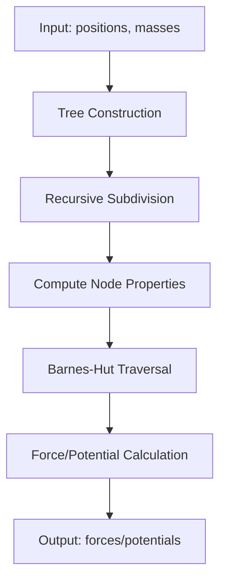

# Design Architecture

This document outlines the high-level architecture and design decisions of the bhut library.

## Overview

bhut is structured as a modular library with clear separation of concerns:

```
bhut/
├── api.py          # Public API functions
├── backends/       # Computational backends
├── tree/           # Tree data structures
├── traverse/       # Tree traversal algorithms
├── space/          # Spatial data structures
└── utils/          # Utilities and helpers
```

## Core Components

### 1. Backends (`bhut.backends`)

The backend system provides pluggable computational engines:

- **`numpy_`**: Pure NumPy implementation for small to medium datasets
- **`dask_`**: Distributed computing for large datasets
- **`base`**: Abstract base class defining the backend interface

```python
# Backend selection
tree = bhut.Tree(positions, masses, backend='numpy')
tree = bhut.Tree(positions, masses, backend='dask')
```

### 2. Tree Structure (`bhut.tree`)

Core tree data structures and operations:

- **`node.py`**: Tree node implementation (internal and leaf nodes)
- **`build.py`**: Tree construction algorithms
- **`refit.py`**: Efficient tree updating for dynamic simulations

### 3. Traversal (`bhut.traverse`)

Tree traversal algorithms implementing the Barnes-Hut method:

- **`bh.py`**: Main Barnes-Hut traversal algorithm
- **`kernels.py`**: Force/potential calculation kernels

### 4. Spatial Structures (`bhut.space`)

Spatial data structures and utilities:

- **`bbox.py`**: Bounding box operations for tree subdivision

### 5. Utilities (`bhut.utils`)

Helper functions and optimizations:

- **`morton.py`**: Morton encoding for spatial ordering

## Algorithm Flow



*Note: Mermaid diagram will be rendered in the documentation*

## Design Principles

### 1. Modularity
Each component has a single responsibility and clear interfaces.

### 2. Performance
- Efficient tree construction using Morton ordering
- Vectorized operations where possible
- Memory-conscious data structures

### 3. Flexibility
- Multiple backends for different scales
- Configurable parameters (theta, leaf_size, etc.)
- Support for both 2D and 3D problems

### 4. Extensibility
- Plugin architecture for backends
- Abstract base classes for easy extension
- Clear separation of algorithm from implementation

## Memory Layout

The tree uses a compact memory layout for cache efficiency:

- Nodes stored in breadth-first order
- Contiguous arrays for node properties
- Minimal indirection in hot paths

## Threading and Parallelization

- NumPy backend: Uses NumPy's built-in parallelization
- Dask backend: Distributed computation across workers
- Thread-safe by design for read-only operations

## Future Extensions

Planned architectural improvements:

- GPU backend using CuPy/JAX
- Adaptive mesh refinement
- Multipole expansions for higher accuracy