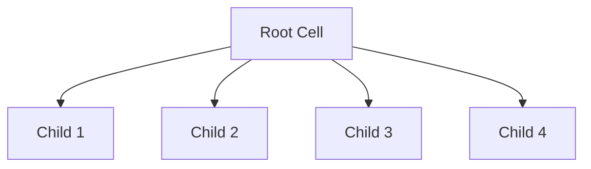

# Barnes-Hut Algorithm

The Barnes-Hut algorithm is a fast approximate method for computing N-body forces, reducing the computational complexity from O(N²) to O(N log N).

## Basic Principle

Instead of computing forces between every pair of particles, the Barnes-Hut algorithm groups distant particles and treats them as a single mass located at their center of mass.

## Tree Construction

The algorithm builds a spatial tree (quadtree in 2D, octree in 3D) by recursively subdividing space:

1. Start with a bounding box containing all particles
2. If a region contains more than one particle, subdivide it
3. Continue until each leaf contains at most one particle

## Force Calculation

For each particle, traverse the tree and decide whether to:

- **Use the node**: If the node is sufficiently far away (determined by the θ parameter)
- **Recurse**: If the node is too close, examine its children

### The θ Criterion

A node is considered "far enough" if:

$$\frac{s}{d} < \theta$$

Where:
- $s$ = size of the node (width/height of bounding box)
- $d$ = distance from particle to node's center of mass
- $\theta$ = accuracy parameter (0 = exact, larger = more approximate)

## Force Equations

### Gravitational Force

The gravitational force between two particles is:

$$\vec{F}_{ij} = -G \frac{m_i m_j}{|\vec{r}_{ij}|^3} \vec{r}_{ij}$$

Where:
- $G$ = gravitational constant
- $m_i, m_j$ = masses of particles $i$ and $j$
- $\vec{r}_{ij} = \vec{r}_j - \vec{r}_i$ = displacement vector

### Potential Energy

The gravitational potential at position $\vec{r}_i$ due to particle $j$ is:

$$\phi_i = -G \frac{m_j}{|\vec{r}_{ij}|}$$

### Softened Force

To avoid singularities at small distances, a softening parameter $\epsilon$ is often used:

$$\vec{F}_{ij} = -G \frac{m_i m_j}{(|\vec{r}_{ij}|^2 + \epsilon^2)^{3/2}} \vec{r}_{ij}$$

## Plummer Softening

We use Plummer softening:
\[
\Phi_i = -G \sum_{j \ne i} \frac{m_j}{\sqrt{\|\mathbf{r}_i-\mathbf{r}_j\|^2 + \varepsilon^2}},
\qquad
\mathbf{a}_i = -\nabla \Phi_i
\]

## Quadtree/Octree Split (Mermaid)

## Center of Mass Calculation

For each tree node, the center of mass and total mass are computed:

$$\vec{R}_{cm} = \frac{\sum_i m_i \vec{r}_i}{\sum_i m_i}$$

$$M_{total} = \sum_i m_i$$

## Multipole Expansion

The Barnes-Hut algorithm can be viewed as a first-order multipole expansion. Higher-order terms can be included for improved accuracy:

$$\phi(\vec{r}) = -G \sum_{l=0}^{\infty} \sum_{m=-l}^{l} \frac{A_{lm}}{r^{l+1}} Y_l^m(\theta, \phi)$$

Where $A_{lm}$ are the multipole moments and $Y_l^m$ are spherical harmonics.

## Algorithm Complexity

- **Tree construction**: O(N log N)
- **Force evaluation**: O(N log N) for N particles
- **Memory usage**: O(N)

The key insight is that the number of nodes at each level of the tree is bounded, leading to the logarithmic factor.